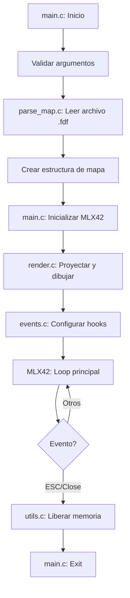

# FDF - Wireframe Model 🏔️

## 📋 Descripción del Proyecto

FDF es un proyecto de visualización 3D que representa modelos alámbricos (wireframe) de paisajes usando proyección isométrica. Lee archivos `.fdf` con valores de altura y los renderiza en una ventana gráfica usando MLX42.

## ⚠️ NORMAS CRÍTICAS DE 42

### 🚨 Restricciones Obligatorias
- **Máximo 5 funciones por archivo `.c`**
- **Máximo 25 líneas por función**
- **PROHIBIDAS las variables globales**
- **CERO fugas de memoria**
- **100% compatible con Norminette**
- **Usar MLX42 (NO MiniLibX)**
- **Makefile completo y funcional**

## 🗂️ Estructura del Proyecto

```
fdf/
├── Makefile
├── includes/
│   ├── fdf.h          # Header principal con estructuras generales
│   ├── map.h          # Estructuras y funciones de parse_map
│   ├── render.h       # Funciones de renderizado
│   ├── events.h       # Gestión de eventos
│   └── utils.h        # Utilidades generales
├── src/
│   ├── main.c         # Flujo principal del programa
│   ├── parse_map.c    # Lectura y procesado de archivos .fdf
│   ├── render.c       # Renderizado del wireframe
│   ├── events.c       # Gestión de eventos de teclado/ventana
│   └── utils.c        # Funciones auxiliares
├── libft/             # Tu libft con get_next_line, ft_split, etc.
├── MLX42/             # Librería gráfica MLX42
└── maps/              # Archivos .fdf de prueba (opcional)
```

## 📁 Responsabilidad de cada Archivo

### 1. `main.c` - Control Principal
**Responsable de:**
- Validar argumentos de entrada
- Inicializar estructuras principales
- Coordinar el flujo del programa
- Liberar todos los recursos al finalizar

**Funciones sugeridas (máx. 5):**
```c
int     main(int argc, char **argv);
void    init_fdf(t_fdf *fdf, char *filename);
void    run_fdf(t_fdf *fdf);
void    cleanup_fdf(t_fdf *fdf);
void    handle_error(char *msg, t_fdf *fdf);
```

### 2. `parse_map.c` - Procesamiento de Mapas
**Responsable de:**
- Leer archivo .fdf línea por línea
- Convertir texto a estructura de puntos 3D
- Validar formato del archivo
- Gestionar colores (si aplica)

**Funciones sugeridas (máx. 5):**
```c
t_map   *parse_map(char *filename);
void    read_map_dimensions(int fd, t_map *map);
void    parse_map_points(int fd, t_map *map);
void    parse_line(char *line, t_map *map, int y);
void    free_map(t_map *map);
```

### 3. `render.c` - Renderizado Gráfico
**Responsable de:**
- Proyección isométrica de puntos 3D a 2D
- Dibujar líneas entre puntos adyacentes
- Gestionar escalado y centrado
- Actualizar la imagen en MLX42

**Funciones sugeridas (máx. 5):**
```c
void    render_map(t_fdf *fdf);
void    project_isometric(t_point *point, t_fdf *fdf);
void    draw_line(t_fdf *fdf, t_point start, t_point end);
void    clear_image(mlx_image_t *img);
void    put_pixel(mlx_image_t *img, int x, int y, uint32_t color);
```

### 4. `events.c` - Gestión de Eventos
**Responsable de:**
- Capturar eventos de teclado (ESC para salir)
- Gestionar cierre de ventana
- Implementar controles adicionales (zoom, rotación, etc.)

**Funciones sugeridas (máx. 5):**
```c
void    setup_hooks(t_fdf *fdf);
void    key_hook(mlx_key_data_t keydata, void *param);
void    close_hook(void *param);
void    scroll_hook(double xdelta, double ydelta, void *param);
```

### 5. `utils.c` - Funciones Auxiliares
**Responsable de:**
- Funciones matemáticas (min, max, abs)
- Gestión de errores comunes
- Liberación de memoria específica
- Helpers de conversión

**Funciones sugeridas (máx. 5):**
```c
int     ft_abs(int n);
int     ft_max(int a, int b);
void    free_split(char **split);
int     get_color(char *str);
void    error_exit(char *msg);
```

## 🔄 Flujo del Programa



## 🏗️ Estructuras Principales

```c
// includes/fdf.h

typedef struct s_point
{
    int     x;
    int     y;
    int     z;
    int     color;
}   t_point;

typedef struct s_map
{
    t_point **points;
    int     width;
    int     height;
    int     z_min;
    int     z_max;
}   t_map;

typedef struct s_fdf
{
    mlx_t       *mlx;
    mlx_image_t *img;
    t_map       *map;
    int         zoom;
    int         x_offset;
    int         y_offset;
}   t_fdf;
```

## 🛠️ Makefile

```makefile
NAME = fdf
CC = cc
CFLAGS = -Wall -Wextra -Werror
INCLUDES = -I./includes -I./libft -I./MLX42/include

SRCS = src/main.c \
       src/parse_map.c \
       src/render.c \
       src/events.c \
       src/utils.c

OBJS = $(SRCS:.c=.o)

# Flags para MLX42 según el OS
UNAME_S := $(shell uname -s)
ifeq ($(UNAME_S),Linux)
    MLX_FLAGS = -lmlx42 -ldl -lglfw -pthread -lm
endif
ifeq ($(UNAME_S),Darwin)
    MLX_FLAGS = -lmlx42 -framework Cocoa -framework OpenGL -framework IOKit -lglfw
endif

all: $(NAME)

$(NAME): $(OBJS)
	make -C libft
	$(CC) $(CFLAGS) $(OBJS) -L./libft -lft -L./MLX42 $(MLX_FLAGS) -o $(NAME)

clean:
	make -C libft clean
	rm -f $(OBJS)

fclean: clean
	make -C libft fclean
	rm -f $(NAME)

re: fclean all

.PHONY: all clean fclean re
```

## 📝 Checklist de Implementación

### Fase 1: Setup Inicial
- [ ] Crear estructura de directorios
- [ ] Configurar Makefile
- [ ] Integrar libft
- [ ] Instalar y configurar MLX42

### Fase 2: Parser
- [ ] Leer dimensiones del mapa
- [ ] Parsear puntos y alturas
- [ ] Gestionar colores (opcional)
- [ ] Validar formato del archivo

### Fase 3: Renderizado Básico
- [ ] Implementar proyección isométrica
- [ ] Dibujar líneas entre puntos
- [ ] Centrar el modelo en pantalla
- [ ] Aplicar zoom inicial apropiado

### Fase 4: Interactividad
- [ ] ESC para salir
- [ ] Cerrar ventana correctamente
- [ ] Liberar toda la memoria

### Fase 5: Validación Final
- [ ] Pasar Norminette
- [ ] Verificar ausencia de leaks (valgrind)
- [ ] Probar con todos los mapas de ejemplo
- [ ] Revisar que cada archivo tenga ≤5 funciones
- [ ] Verificar que cada función tenga ≤25 líneas

## 🎯 Consejos para Cursor.sh y Claude Opus 4

1. **Modularidad Extrema**: Divide funciones grandes en subfunciones auxiliares
2. **Nombres Descriptivos**: Usa nombres claros para funciones y variables
3. **Comentarios Mínimos**: El código debe ser autoexplicativo
4. **Testing Incremental**: Prueba cada módulo por separado
5. **Git Commits Frecuentes**: Guarda progreso después de cada módulo funcional

## 🚀 Compilación y Ejecución

```bash
# Compilar
make

# Ejecutar
./fdf maps/42.fdf

# Limpiar
make fclean

# Verificar leaks
valgrind --leak-check=full ./fdf maps/42.fdf
```

## 📚 Recursos Útiles

### Contenido FDF
- [MLX42 Documentation](https://github.com/codam-coding-college/MLX42)
- [Proyección Isométrica](https://en.wikipedia.org/wiki/Isometric_projection)
- [Algoritmo de Bresenham](https://en.wikipedia.org/wiki/Bresenham%27s_line_algorithm)
- [Transformaciones 3D](https://en.wikipedia.org/wiki/3D_projection)
- [Matemáticas de Gráficos 3D](https://www.scratchapixel.com/lessons/3d-basic-rendering/perspective-and-orthographic-projection-matrix/)
- [Teoría de Colores en Programación](https://en.wikipedia.org/wiki/Color_depth)
- [Gestión de Memoria en C](https://en.wikipedia.org/wiki/Memory_management)
- [Estructuras de Datos para Gráficos](https://en.wikipedia.org/wiki/Data_structure)
- [Optimización de Rendimiento](https://en.wikipedia.org/wiki/Program_optimization)
- [Debugging con Valgrind](https://valgrind.org/docs/manual/quick-start.html)

---

**⚡ RECORDATORIO FINAL**: Este proyecto DEBE cumplir TODAS las normas de 42. Cada violación es motivo de fallo automático.